# aaossa_fansclub_frontend

# E0 :construction:

* :pencil2: **Nombre Grupo:** aaossa_fansclub
* **Link https://exquisite-llama-767906.netlify.app/**

## CONSIDERACIONES IMPORTANTES
**Al abrir el link de la página, se abrirá la landing page. Al presionar Sign Up se abrirá el formulario estático para registrarse en la aplicación, mientras que al presionar Log In se abrirá una dashboard con sus respectivas tasks cards. Además al presionar New Task dentro de la Dashboard o al presionar View en una task específica, se abre el TaskForm estático. Por otra parte, al presionar About Us en la NavBar se abrirá la página con información sobre los integrantes que cambia al pasar el mouse por sobre cada una de las tarjetas. Al presionar Docs en la Navbar se abrirá la página de documentación donde se explica a más detalle nuestra aplicación. Finalmente al presionar Home en la Navbar se enviará nuevamente a la Landing Page.**
**POR FAVOR CONSIDERAR QUE CUANDO EL LINK SEA DISTINTO DE https://exquisite-llama-767906.netlify.app/ NO SE DEBE HACER REFRESH DE LA PÁGINA. EJ: https://exquisite-llama-767906.netlify.app/about EN UN LINK DE ESE TIPO NO HAY QUE HACER REFRESH, SÓLO EN EL LINK PRINICIPAL**

## Descripción general :thought_balloon:

- ¿De qué se tratará el proyecto? **Este proyecto tratará de crear un planificador en línea en el contexto de una empresa que cuenta con distintas áreas.**
- ¿Cuál es el fin o la utilidad del proyecto? **Este proyecto tendrá utilidad para empresas a la hora de asignar tareas y dividir trabajo entre equipos y empleados.**
- ¿Quiénes son los usuarios objetivo de su aplicación? **Los usuarios objetivos de nuestra aplicación son empresas que trabajan en grupo y tienen que dividir tareas entre personas distintas.**

## Historia de Usuarios :busts_in_silhouette:

1. Como usuario no registrado, quiero crear una nueva cuenta usando un nombre de usuario y contraseña, y especificar el rol que tendré dentro de mi organización (Manager/Team Leader/Worker). 
2. Como User (Manager/Team Leader/Worker), quiero verificar mi nombre de usuario y contraseña, para entrar en mi cuenta.
3. Como Worker, quiero entrar a mi Dashboard, para ver un Overview de las tasks pendientes que tengo.
4. Como Team Leader, quiero entrar a mi Dashboard, para ver el progreso de los planes que he creado.
5. Como Manager, quiero entrar a mi Dashboard, para ver el progreso de las metas que he creado.
6. Como Team Leader, quiero crear planes, para asignarlos a trabajadores.
7. Como Team Leader, quiero crear tasks dentro de mis planes, para subdividir las cosas que hay que hacer.
8. Como Team Leader, quiero asignar tasks a un trabajador, para dividir el trabajo de mi equipo.
9. Como Worker, quiero asignarme tasks, para progresar en los planes asignadas.
10. Como Worker, quiero recibir una notificación cuando me asignen una task o un plan, para saber las cosas que tengo que hacer.
11. Como Team Leader, quiero definir un límite del número de tasks que pueden tener los miembros de mi equipo, para limitar la carga de cada uno.
12. Como Manager, quiero crear equipos, para organizar a las personas de mi organización.
13. Como Manager, quiero crear metas para mis equipos, para enfocar el trabajo de mi organización.
14. Como Worker, quiero marcar como completada una task, para que mi Team Leader sepa que está terminada. 
15. Como Team Leader, quiero recibir una notificación cuando un Worker termina una task, para saber el progreso de nuestras metas.

## Diagrama Entidad-Relación :scroll:
<!-- Insertamos la imagen ER-Model.png -->
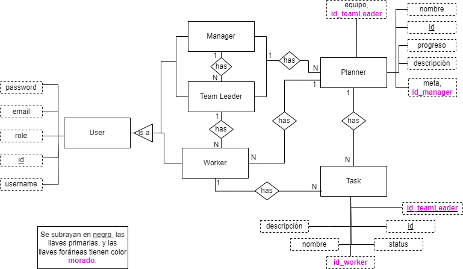

## Diseño Web :computer:

<!-- Documento de diseño web -->
### :art: Documento de diseño
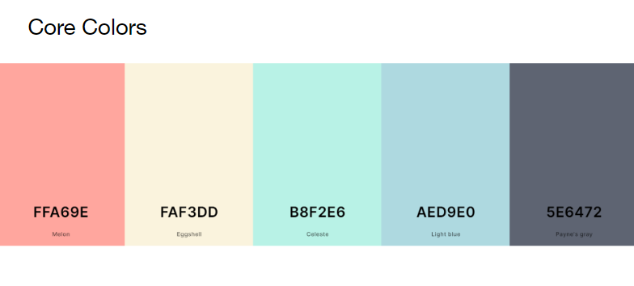
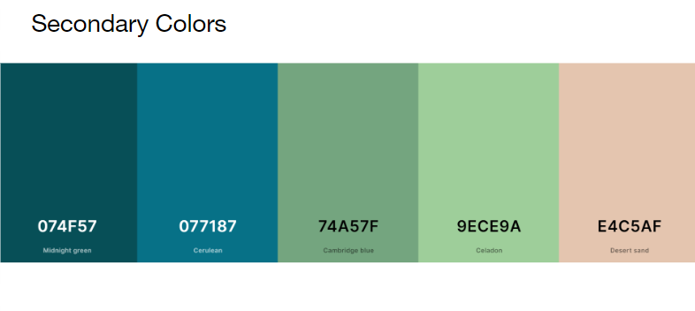
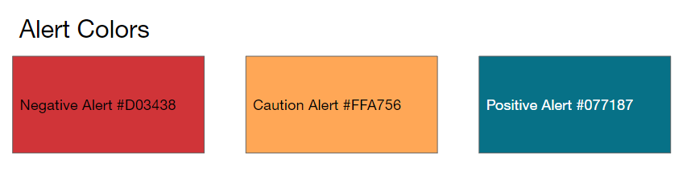
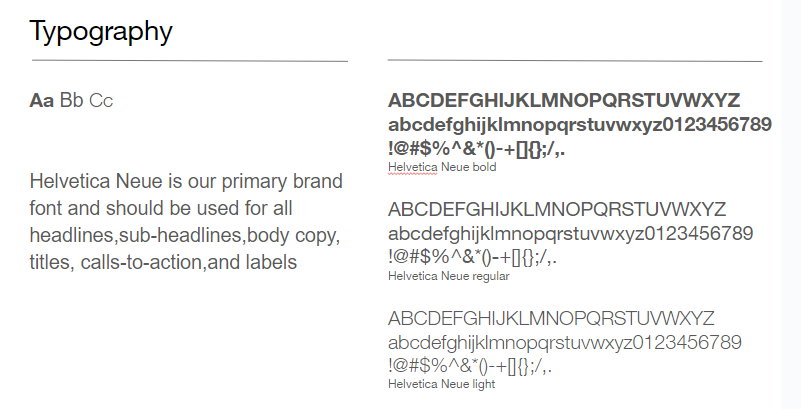
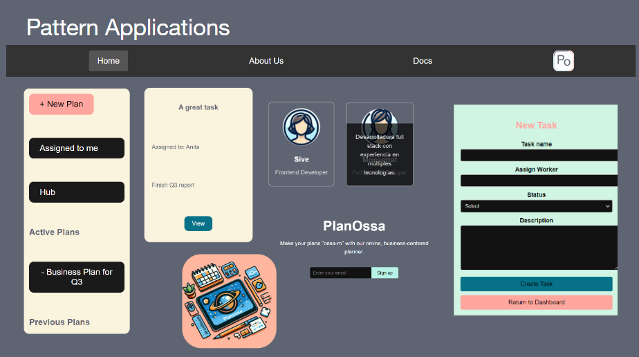

<!-- Vistas principales -->
### :mag: Vistas principales
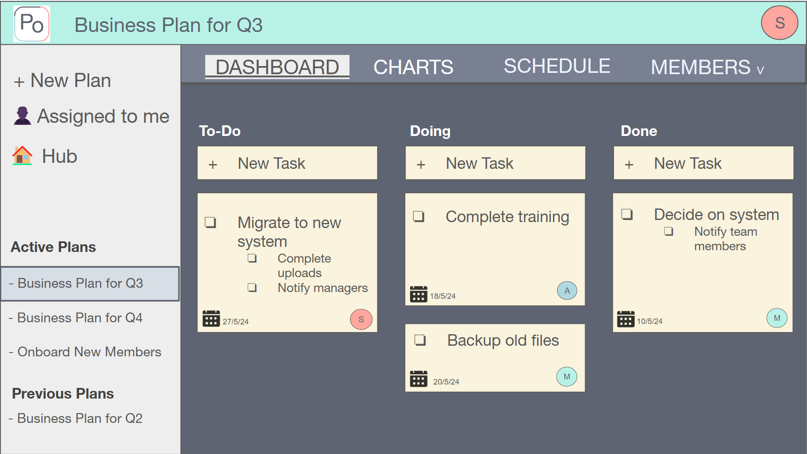
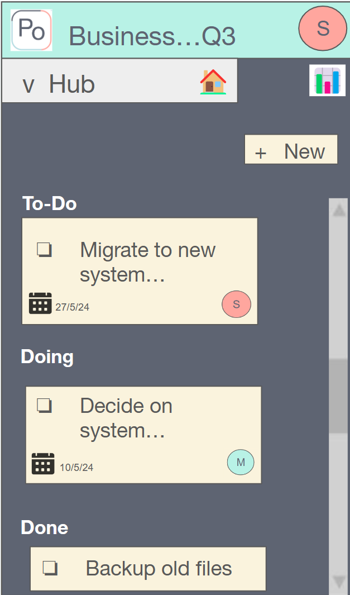
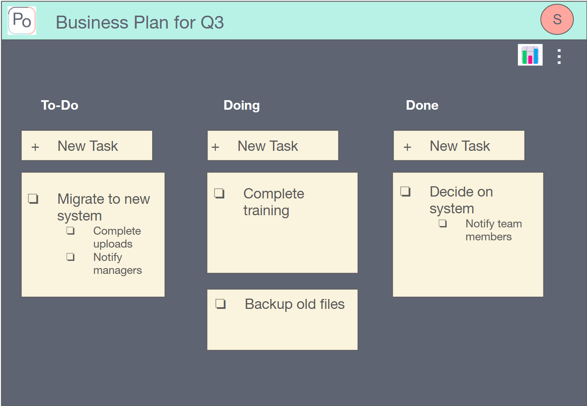
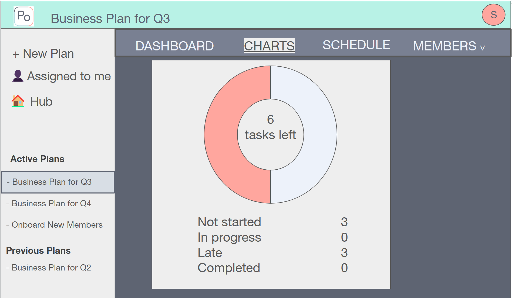
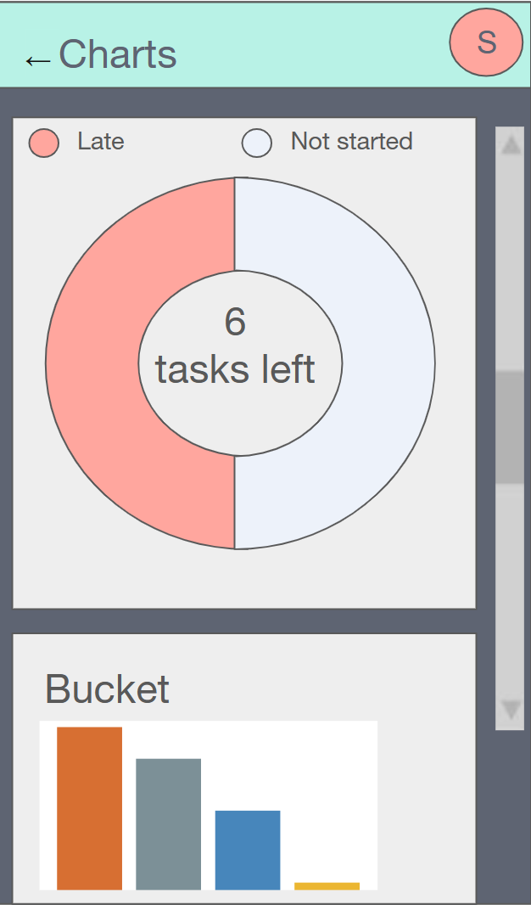
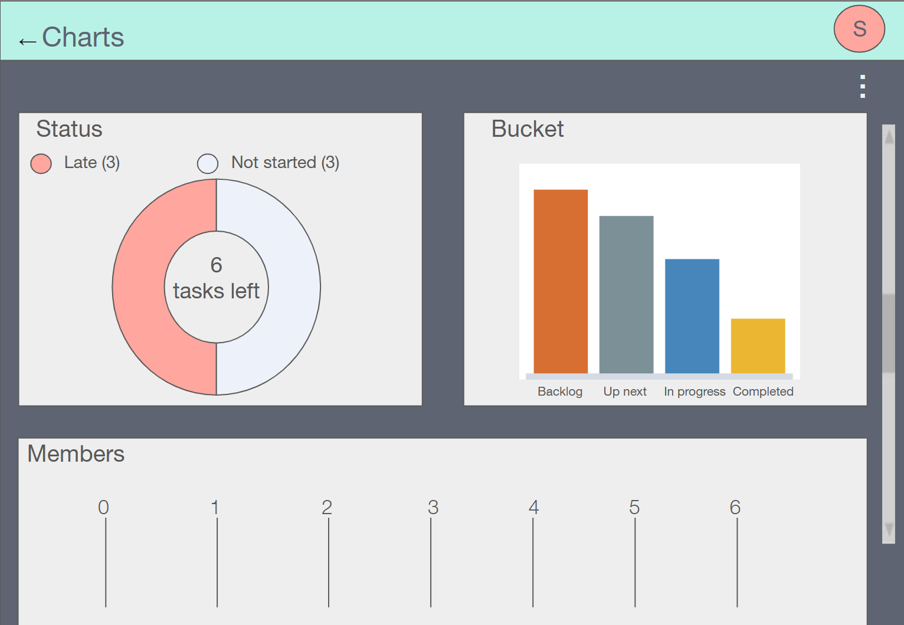
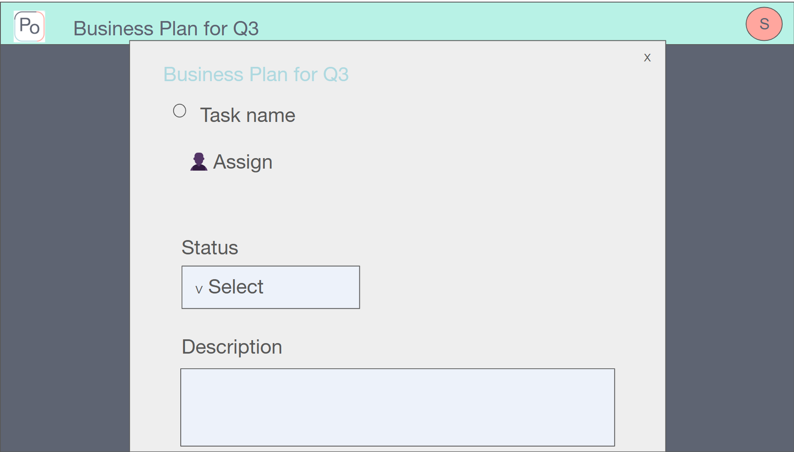
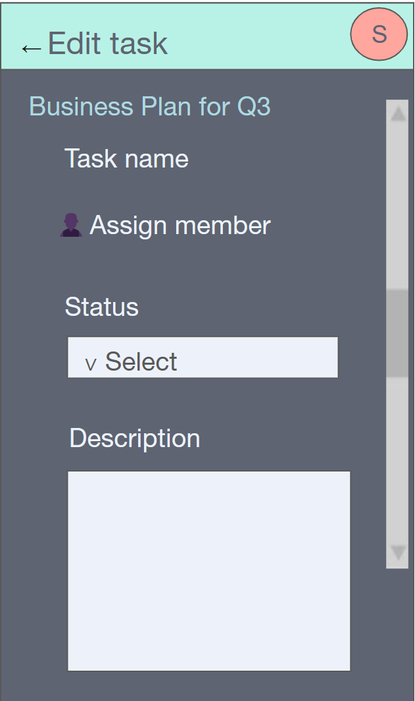
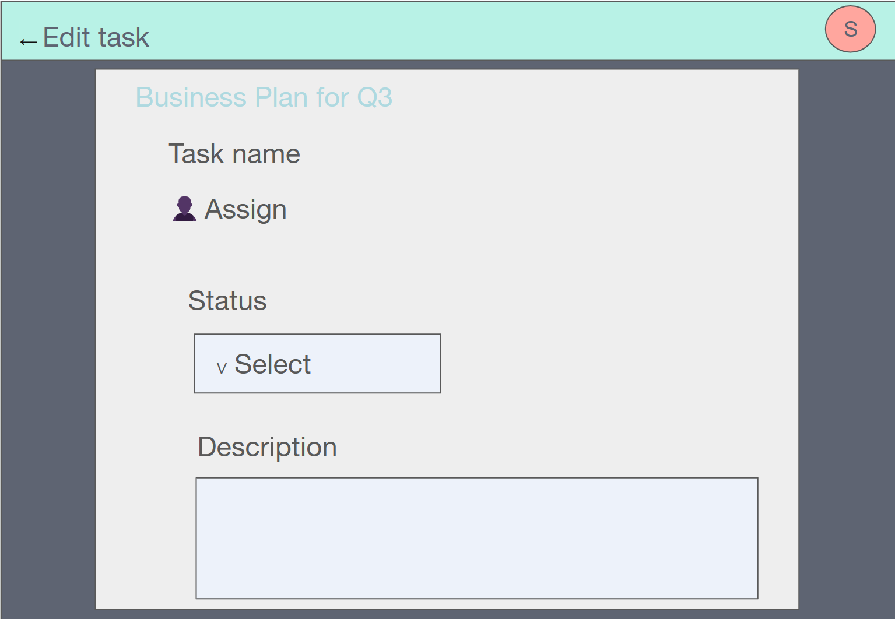

<!-- Logo -->
### :art: Logo
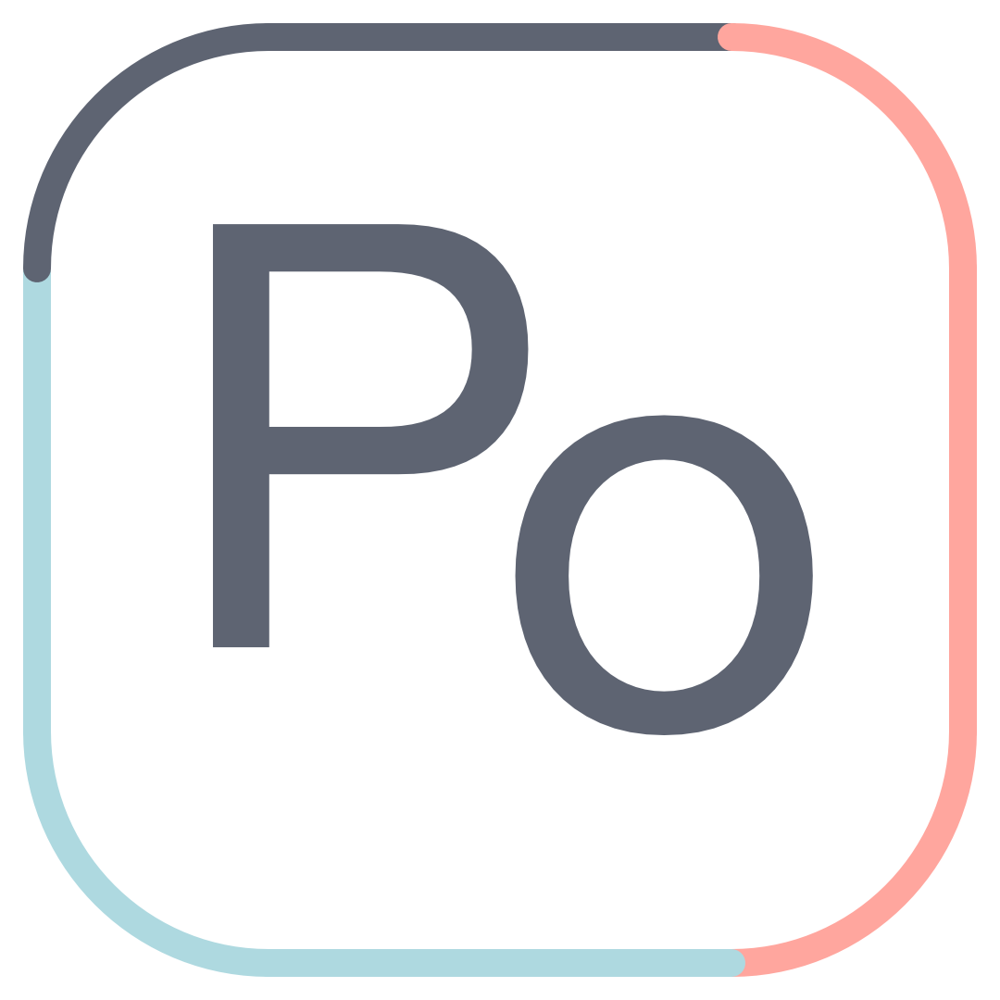
